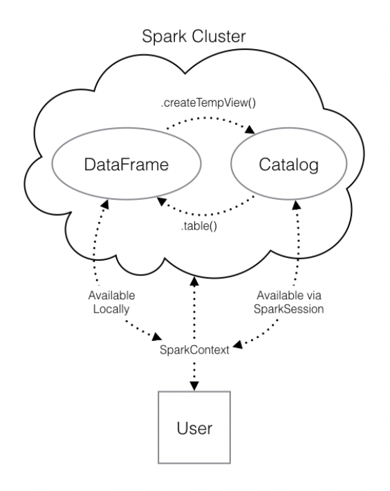

# Spark + Python = PySpark

🗓️ 18th August 2023 👤 Sergi Marin-Arànega 📍 Barcelona

Write introduction

## Using Spark

[More info](https://spark.apache.org/docs/2.1.0/api/python/pyspark.sql.html)

The first step to use Spark is to connect to a cluster. The cluster will be hosted on a remote machine that's connected to all other nodes. There is a **driver** node and **worker** nodes. The **driver** node manages splitting up the data and calculations and sends them to the **workers**. These send back the results to the **driver**.

To create a connection to the cluster create an instance of the `SparkContext` class. More info [here](https://spark.apache.org/docs/2.1.0/api/python/pyspark.html#pyspark.SparkContext).

## Using DataFrames

The Spark DataFrame behaves like an SQL table.

First create a `SparkSession` from `SparkContext`. Think of the `SparkContext` as the connection to the cluster and of the `SparkSession` as its interface.

Creating several `SparkSession`s can create issues so it's better to use the method `SparkSession.builder.getOrCreate()` which will return a session if it already exists or create a new one.

`SparkSession.catalog.listTables()` will return a list with the names of all tables in the cluster as a list.

We can run SQL style queries on our tables. To run a query on a table use the `.sql()` method. The method takes as input a string with the SQL query and returns a DataFrame with the result.

To work locally with a DataFrame use the `.toPandas()` method. Then use any panda's method on that panda's DataFrame.

To put a panda's DataFrame into a Spark cluster use the `.createDataFrame()` method. The output is a Spark DataFrame that is stored locally, not in the `SparkSession` catalog. To access the data using a query we have to save it into a temporary table using the `.createTempView()` method. This method registers the DataFrame as a table in the catalog, but as this table is temporary, it can only be accessed from the specific `SparkSession` used to create the Spark DataFrame. To avoid problems with duplicated tables use the `createOrReplaceTempView()` method.

To read data files directly to Spark use the `.read` attribute that has several methods to read different data structures directly into Spark DataFrames.

Spark DataFrames are immutable. This means that it can't be changed, and so columns can't be updated in place as in pandas. All methods return a new DataFrame so to overwrite the original one we have to reassign it:

    df = df.withColumn("newCol", df.oldCol)

## Machine Learning Pipelines

Spark only handles numeric data. That means all of the columns in your DataFrame must be either integers or decimals.

Spark interprets the type of data stored in each column. To transform into numerical data usa the `.cast()` method in combination with the .`withColumn()` method with the argument `"integer"` or `"double"`.

A *one-hot vector* is a way of representing a categorical feature where every observation has a vector in which all elements are zero except for at most one element, which has a value of one (1). Each element in the vector corresponds to a level of the feature, so it's possible to tell what the right level is by seeing which element of the vector is equal to one (1). First create a `StringIndexer`, then use `OneHotEncoder`.

Last step in the `Pipeline` is to combine all columns containing features into o single column. Every Spark model expect the data in this form. From the model's point of view, every observation is a vector with all of the information about it and a label that tells the modeler what value that observation corresponds to. The `VectorAssembler` class does this.

`Pipeline` is a class in the `pyspark.ml` module that combines all the Estimators and Transformers that you've already created. This lets you reuse the same modeling process over and over again by wrapping it up in one simple object. The main input is `stages` that should be a list holding all the stages you want your data to go through in the pipeline.

After you've cleaned your data and gotten it ready for modeling, one of the most important steps is to split the data into a *test set* and a *train set*. After that, don't touch your test data!

Once you've got your favorite model, you can see how well it predicts the new data in your test set. This *never-before-seen* data will give you a much more realistic idea of your model's performance in the real world when you're trying to predict or classify new data.

Use `.randomSplit()` to split the data after the pipeline into two pieces, training with XX% of the data, and test with YY% of the data by passing the list `[.XX, .YY]` to the `.randomSplit()` method.

A *hyperparameter* is just a value in the model that's not estimated from the data, but rather is supplied by the user to maximize performance.

*k-fold cross validation* works by splitting the training data into a few different partitions. Every block of data is held out and used as a test set exactly once. Then the error on each of the partitions is averaged. This is called the cross validation error of the model.

`pyspark.ml.evaluation` submodule has classes for evaluating different kinds of models. Your model is a binary classification model, so you'll be using the `BinaryClassificationEvaluator`.

This evaluator calculates the [area under the ROC](https://developers.google.com/machine-learning/crash-course/classification/roc-and-auc).

`pyspark.ml.tuning` includes a class called `ParamGridBuilder` that creates a grid of values to search over for optimal hyperparameters.

The `CrossValidator` class performs cross validation. Takes as input the model you want to fit, the grid of hyperparameters, and the evaluator to compare your models.
